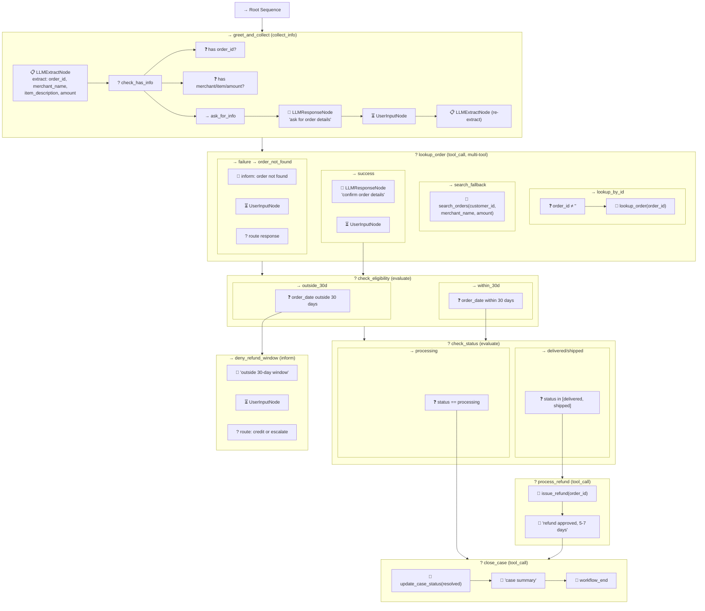
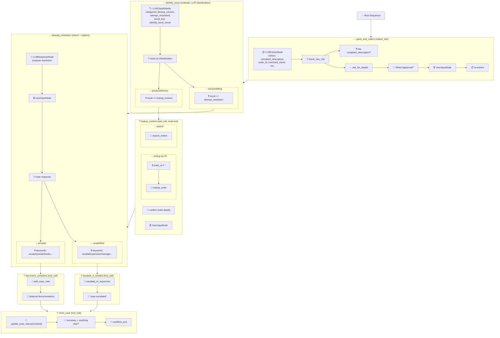
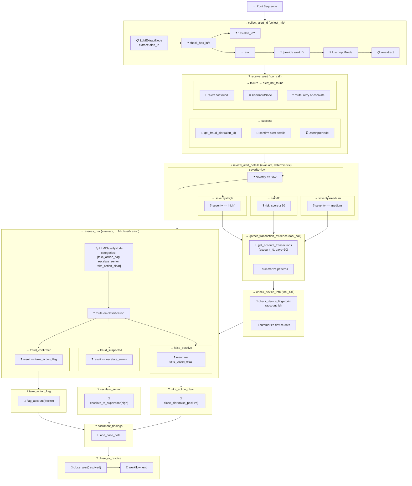

# Behaviour Tree Architecture Diagrams

This document provides visual architecture diagrams and flow explanations for each example procedure in the `procedures/` directory. Each procedure is compiled from YAML into an async Behaviour Tree composed of standard node types.

## Node Type Legend

| Node Type | Symbol | Purpose |
|-----------|--------|---------|
| **Sequence** | `→` | Runs children left-to-right; fails on first failure |
| **Selector** | `?` | Runs children left-to-right; succeeds on first success |
| **LLMExtractNode** | `📋` | Extracts structured fields from user message |
| **LLMResponseNode** | `💬` | Generates LLM response to user |
| **LLMClassifyNode** | `🏷️` | Classifies input into one of N categories via constrained decoding |
| **UserInputNode** | `⏳` | Pauses tree; waits for next user message |
| **ConditionNode** | `❓` | Evaluates a predicate against blackboard data |
| **ToolActionNode** | `🔧` | Calls an external tool function |
| **LogNode** | `📝` | Logs a message (used for end/transitions) |

---

## 1. Customer Service — Refund Request (`cs_refund`)

### High-Level Flow

```
┌─────────────────┐
│ greet_and_collect│  action: collect_info
│ Collect Order ID │  extract: order_id, merchant_name, item_description, amount
└────────┬────────┘
         │
         ▼
┌─────────────────┐
│  lookup_order   │  action: tool_call (guarded)
│  Find the Order │  tool: lookup_order (if order_id) OR search_orders (fallback)
└───┬─────────┬───┘
    │         │
 success    failure
    │         │
    ▼         ▼
┌──────────┐ ┌──────────────┐
│ check_   │ │order_not_found│  action: inform
│eligibility│ │ Suggest retry │  options: [Try again → greet_and_collect,
└────┬─────┘ └──────────────┘          Escalate → escalate_case]
     │
     ▼
┌──────────────────────────────────────┐
│         check_eligibility            │  action: evaluate (deterministic)
│  order_date within 30 days?          │
└───────┬──────────────┬───────────────┘
        │              │
   within 30d      outside 30d
        │              │
        ▼              ▼
┌──────────┐    ┌─────────────────┐
│check_    │    │deny_refund_     │  action: inform
│status    │    │window           │  options: [Store credit → offer_store_credit,
└──┬───┬───┘    └─────────────────┘          Escalation → escalate_case]
   │   │
   │   └──── status == "processing" ──►┌──────────────┐
   │                                   │ cancel_order  │  tool: update_case_status
   └──── status in [delivered,shipped] │               │  (status: "cancelled")
         │                             └──────┬───────┘
         ▼                                    │
┌────────────────┐                            │
│ process_refund │  tool: issue_refund        │
│ (await:false)  │                            │
└───────┬────────┘                            │
        │              ┌──────────────────┐   │
        │              │offer_store_credit│   │
        │              │tool:issue_store_ │   │
        │              │credit (await:f)  │   │
        │              └───────┬──────────┘   │
        │                      │              │
        ▼                      ▼              ▼
┌──────────────────────────────────────────────┐
│              close_case                       │  tool: update_case_status
│  Summarize resolution, mark resolved          │  (status: "resolved")
└──────────────────┬───────────────────────────┘
                   │
                   ▼
               [ END ]
```

### Compiled Behaviour Tree Structure



### Flow Explanation

1. **greet_and_collect** (`collect_info`): The tree starts by extracting order identifiers from the user's message. A Selector checks whether an `order_id` or descriptive clues (merchant name, item, amount) were found. If neither, the LLM asks the user and waits for input before re-extracting.

2. **lookup_order** (`tool_call`, multi-tool with guards): A Selector tries two tool paths in order. If `order_id ≠ ""`, it calls `lookup_order`. Otherwise, it falls back to `search_orders` using whatever descriptive fields are available. On success, it confirms details with the user. On failure, it routes to `order_not_found`.

3. **check_eligibility** (`evaluate`, deterministic): A Selector evaluates `order_date` against the 30-day return window using `ConditionNode` predicates compiled from structured conditions (`within_days` / `outside_days`).

4. **check_status** (`evaluate`, deterministic): For eligible orders, checks whether the order is `delivered`/`shipped` (refund path) or `processing` (cancellation path).

5. **process_refund / cancel_order / offer_store_credit** (`tool_call`, `await_input: false`): These intermediate steps call their respective tools and flow through automatically without waiting for user input.

6. **deny_refund_window** (`inform` with options): Presents alternatives (store credit or escalation) and waits for user response. `detection_keywords` on each option enable deterministic routing without LLM classification.

7. **close_case** (`tool_call`): Updates case status to resolved, generates a summary, and terminates with `LogNode("workflow_end")`.

**Cycle**: `order_not_found → greet_and_collect` forms a back-edge. The compiler detects this and terminates with `UserInputNode`. On next user message, the runner re-ticks from root with updated blackboard state.

---

## 2. Customer Service — Complaint Handling (`cs_complaint`)

### High-Level Flow

```
┌──────────────────┐
│ greet_and_collect │  action: collect_info
│ Collect Complaint │  extract: complaint_description, order_id,
│   Details         │          merchant_name, item_description, amount
└────────┬─────────┘
         │
         ▼
┌──────────────────────────────────────────────┐
│              identify_issue                   │  action: evaluate (LLM classification)
│  classify_categories:                         │
│    [lookup_context, attempt_resolution]        │
│                                               │
│  product_quality / delivery → lookup_context  │
│  service / billing → attempt_resolution       │
└──────┬──────────────────────┬────────────────┘
       │                      │
       ▼                      │
┌──────────────────┐          │
│  lookup_context  │          │
│  tool_call       │          │
│  (guarded:       │          │
│   lookup_order   │          │
│   OR             │          │
│   search_orders) │          │
└────────┬─────────┘          │
         │                    │
         ▼                    ▼
┌──────────────────────────────────────────────┐
│            attempt_resolution                 │  action: inform
│  Present tailored resolution based on type    │  options:
│                                               │    [Accept → document_complaint,
│  product_quality → replacement/refund         │     Unsatisfied → escalate_if_needed]
│  delivery → reship/trace/refund               │
│  service → apology + store credit             │
│  billing → explain/correct charge             │
└──────┬──────────────────────┬────────────────┘
       │                      │
    accepts               unsatisfied
       │                      │
       ▼                      ▼
┌──────────────┐    ┌───────────────────┐
│  document_   │    │ escalate_if_needed│  tool: escalate_to_supervisor
│  complaint   │    │ (await:false)     │
│ tool:        │    └────────┬──────────┘
│ add_case_note│             │
│ (await:false)│             │
└──────┬───────┘             │
       │                     │
       ▼                     ▼
┌──────────────────────────────────────────────┐
│                close_case                     │  tool: update_case_status
│  Summarize resolution, confirm satisfaction   │  (status: "resolved")
└──────────────────────┬───────────────────────┘
                       │
                       ▼
                   [ END ]
```

### Compiled Behaviour Tree Structure



### Flow Explanation

1. **greet_and_collect** (`collect_info`): Extracts complaint details — the `complaint_description` is required. If the user's message contains identifiable details (order number, merchant, item), the tree proceeds immediately. Otherwise, it asks the user to describe what happened.

2. **identify_issue** (`evaluate`, LLM classification): This is the key architectural difference from the refund procedure. The conditions are **subjective** — determining whether a complaint is about product quality vs. service requires understanding natural language. The compiler generates an `LLMClassifyNode` with constrained enum decoding (`text/x.enum`) to classify into exactly one of `[lookup_context, attempt_resolution]`. No regex condition parsing is used here.

3. **lookup_context** (`tool_call`, multi-tool with guards): Same pattern as the refund procedure — guarded tool selection between `lookup_order` (exact ID) and `search_orders` (descriptive search). Both success and failure flow into `attempt_resolution`, since the complaint can be addressed even without order data.

4. **attempt_resolution** (`inform` with options): The LLM generates a tailored resolution based on the complaint type and any order context. `detection_keywords` on each option deterministically route the user's response — keywords like "accept", "yes", "thanks" route to documentation, while "escalat", "supervisor", "manager" route to escalation.

5. **document_complaint** (`tool_call`, `await_input: false`): Internal documentation step — calls `add_case_note` and flows through without user interaction.

6. **escalate_if_needed** (`tool_call`, `await_input: false`): Calls `escalate_to_supervisor` with compiled `fixed_args` and flows through automatically.

7. **close_case** (`tool_call`): Same terminal pattern as the refund procedure.

**Key pattern — LLM Classification**: The `identify_issue` step demonstrates how subjective routing works. Instead of deterministic `ConditionNode` predicates, the tree uses:
```
→ Sequence:
    🏷️ LLMClassifyNode(categories=[lookup_context, attempt_resolution])
    ? Selector:
        → Sequence: ❓ result == "lookup_context" → [lookup subtree]
        → Sequence: ❓ result == "attempt_resolution" → [resolution subtree]
```

---

## 3. Fraud Operations — Alert Triage (`fraud_alert_triage`)

### High-Level Flow

```
┌───────────────────┐
│  collect_alert_id │  action: collect_info
│  Get FA-XXX ID    │  extract: alert_id
└─────────┬─────────┘
          │
          ▼
┌───────────────────┐
│   receive_alert   │  action: tool_call
│  get_fraud_alert  │  tool: get_fraud_alert(alert_id)
└────┬──────────┬───┘
     │          │
  success    failure
     │          │
     ▼          ▼
┌───────────┐  ┌────────────────┐
│  review_  │  │ alert_not_found│  action: inform
│  alert_   │  │                │  options: [Try again → receive_alert,
│  details  │  └────────────────┘          Escalate → escalate_senior]
│           │
│ evaluate  │
│(determin- │
│  istic)   │
└──┬──┬──┬──┘
   │  │  │
   │  │  └── severity == "low" ─────────────────────────┐
   │  │                                                  │
   │  └── severity == "medium" OR risk_score >= 80 ──┐   │
   │                                                  │   │
   └── severity == "high" ──┐                         │   │
                            │                         │   │
                            ▼                         ▼   │
                   ┌──────────────────────────────┐       │
                   │  gather_transaction_evidence │       │
                   │  tool: get_account_           │       │
                   │  transactions(30 days)        │       │
                   │  (await_input: false)          │       │
                   └──────────┬───────────────────┘       │
                              │                           │
                              ▼                           │
                   ┌──────────────────────────────┐       │
                   │  check_device_info           │       │
                   │  tool: check_device_          │       │
                   │  fingerprint                  │       │
                   │  (await_input: false)          │       │
                   └──────────┬───────────────────┘       │
                              │                           │
                              ▼                           ▼
                   ┌──────────────────────────────────────────┐
                   │            assess_risk                    │
                   │  evaluate (LLM classification)           │
                   │  classify_categories:                     │
                   │    [take_action_flag,                     │
                   │     escalate_senior,                      │
                   │     take_action_clear]                    │
                   └───┬──────────┬──────────┬───────────────┘
                       │          │          │
                  confirmed   suspected   false_positive
                       │          │          │
                       ▼          ▼          ▼
              ┌────────────┐ ┌────────┐ ┌──────────────┐
              │take_action_│ │escalate│ │take_action_  │
              │flag        │ │_senior │ │clear         │
              │🔧 flag_    │ │🔧 esc. │ │🔧 close_    │
              │account     │ │to_sup  │ │alert(false_  │
              │(freeze)    │ │(high)  │ │positive)     │
              └─────┬──────┘ └───┬────┘ └──────┬───────┘
                    │            │              │
                    ▼            ▼              ▼
              ┌────────────────────────────────────────┐
              │          document_findings              │
              │  tool: add_case_note                    │
              │  (await_input: false)                   │
              └──────────────────┬─────────────────────┘
                                 │
                                 ▼
              ┌────────────────────────────────────────┐
              │          close_or_resolve               │
              │  tool: close_alert(resolved)            │
              └──────────────────┬─────────────────────┘
                                 │
                                 ▼
                             [ END ]
```

### Compiled Behaviour Tree Structure



### Flow Explanation

1. **collect_alert_id** (`collect_info`): Extracts the fraud alert ID (e.g., "FA-001") from the analyst's message. Simple single-field extraction with `required_fields: [alert_id]`.

2. **receive_alert** (`tool_call`, single tool): Calls `get_fraud_alert` to retrieve alert details. On failure, routes to `alert_not_found` which offers retry or escalation.

3. **review_alert_details** (`evaluate`, deterministic): Four `ConditionNode` predicates in a Selector evaluate severity and risk score. This is a **priority-ordered evaluation** — `severity == "high"` is checked first, then `risk_score >= 80`, then medium, then low. The first matching condition wins.

4. **gather_transaction_evidence** (`tool_call`, `await_input: false`): For high/medium severity alerts, pulls 30 days of transaction history. Flows through automatically — this is an internal evidence-gathering step.

5. **check_device_info** (`tool_call`, `await_input: false`): Retrieves device fingerprint and login patterns. Also flows through automatically, chaining with the previous evidence step.

6. **assess_risk** (`evaluate`, LLM classification): The most sophisticated node in any procedure. After gathering all evidence (alert + transactions + device data), the LLM classifies the cumulative risk into one of three categories:
   - `take_action_flag` — fraud confirmed, freeze account
   - `escalate_senior` — ambiguous evidence, needs senior review
   - `take_action_clear` — false positive, close alert

   This uses `LLMClassifyNode` with constrained enum decoding because the risk assessment is inherently subjective — it weighs multiple signals holistically.

7. **take_action_flag / escalate_senior / take_action_clear** (`tool_call`, `await_input: false`): Each path calls the appropriate tool (`flag_account`, `escalate_to_supervisor`, or `close_alert`) and flows into documentation.

8. **document_findings → close_or_resolve**: Terminal chain that records case notes and closes the alert.

**Key pattern — Evidence Pipeline**: The fraud procedure demonstrates a sequential evidence-gathering pipeline where multiple `tool_call` steps with `await_input: false` chain together:
```
gather_transaction_evidence → check_device_info → assess_risk
```
Each step enriches the blackboard with new data. The final `assess_risk` node has access to all accumulated evidence for its classification decision.

**Key pattern — Severity-based Routing**: Low severity alerts skip the full evidence pipeline and go directly to `assess_risk` with only the alert data. High/medium alerts gather full evidence first. This is implemented as a deterministic Selector with ordered conditions.

---

## Architectural Patterns Summary

### Pattern 1: Deterministic vs. LLM-Based Routing

| Procedure | Step | Routing Type | Why |
|-----------|------|-------------|-----|
| Refund | check_eligibility | Deterministic (`within_days`) | Date math is objective |
| Refund | check_status | Deterministic (`in`, `eq`) | Status is an enum |
| Complaint | identify_issue | LLM Classification | Complaint categorization is subjective |
| Fraud | review_alert_details | Deterministic (`eq`, `gte`) | Severity/score are structured data |
| Fraud | assess_risk | LLM Classification | Holistic risk assessment is subjective |

### Pattern 2: Guarded Multi-Tool Selection

All three procedures use the same pattern for order/alert lookup:

```
? Selector
    → Sequence: ❓ guard(exact_id ≠ "") → 🔧 lookup_by_id
    → Sequence: 🔧 search_by_description (fallback)
```

### Pattern 3: Automatic Flow-Through (`await_input: false`)

Steps that don't need user interaction set `await_input: false` to skip the `UserInputNode` pause:

| Procedure | Steps with await_input: false |
|-----------|-------------------------------|
| Refund | process_refund, offer_store_credit, cancel_order, escalate_case, close_case |
| Complaint | escalate_if_needed, document_complaint |
| Fraud | gather_transaction_evidence, check_device_info, take_action_flag, take_action_clear, escalate_senior, document_findings |

### Pattern 4: Cycle Handling (Back-Edges)

```
order_not_found ──"Try again"──→ greet_and_collect  (Refund)
alert_not_found ──"Try again"──→ receive_alert      (Fraud)
```

The compiler detects these as back-edges, terminates with `UserInputNode`, and the runner re-ticks from root on the next message. The blackboard retains all previously collected data.

### Pattern 5: Keyword-Based Option Routing

`inform` steps with options use `detection_keywords` for deterministic routing without LLM involvement:

```
? Selector
    → Sequence: ❓ keywords(["accept","yes","ok"]) → [next subtree]
    → Sequence: ❓ keywords(["escalat","supervisor"]) → [next subtree]
```

This is faster and more predictable than LLM-based routing for binary choices.
